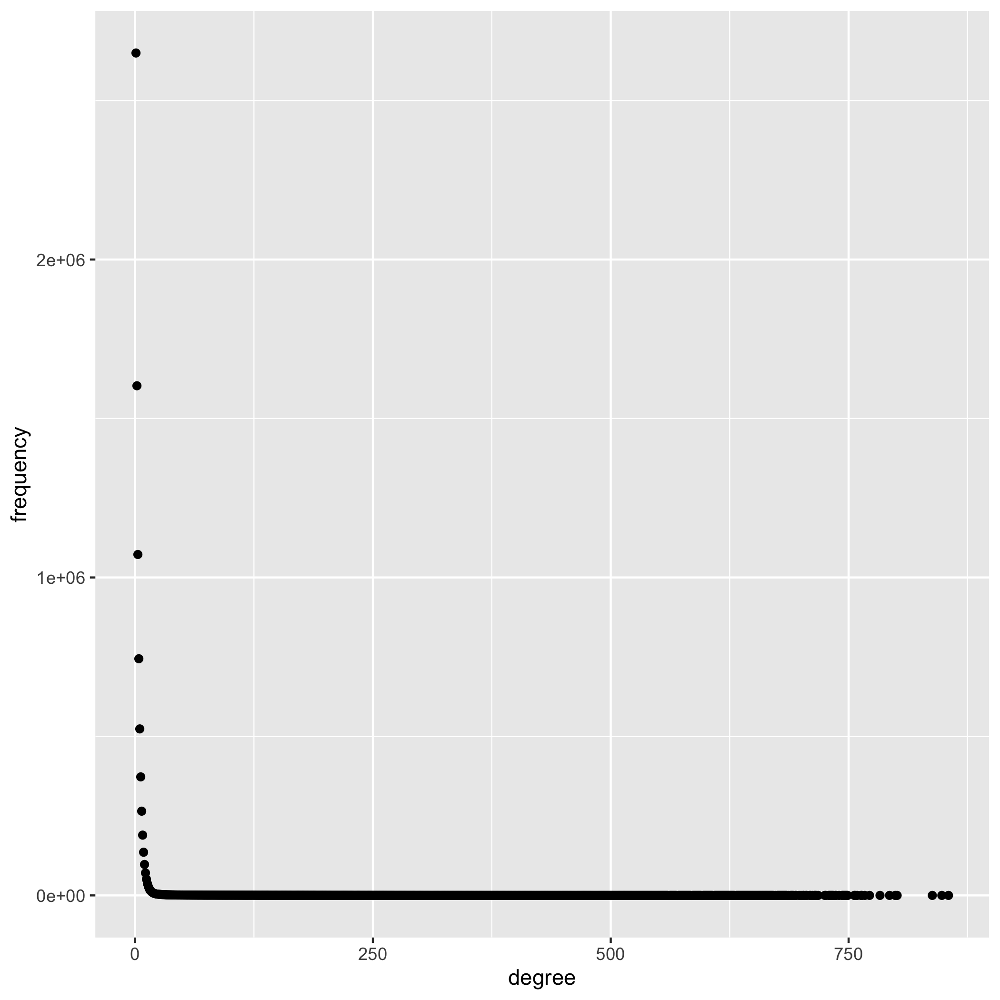
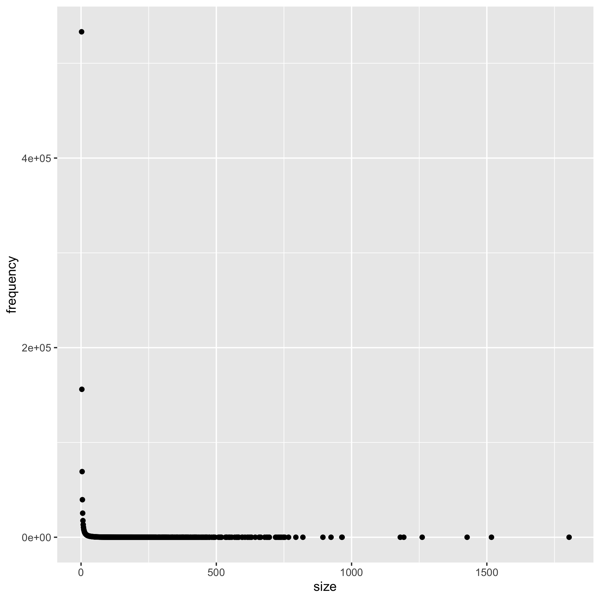

---
output:
  html_document: default
  pdf_document: default
---
## Report 

### Introduction

The purpose of this report is to document the work done to provide some statistical information about the set of DNA segments (also known as contigs) connected as a *undirected* graph where the segments (contigs from now on) are vertices. If two contigs have significant overlaps between them, they are connected to each other and in the graph, there exists an edge between them. For a given contig $i$, the number of contigs connected to it defines its degree. Further, a component is made up of a chain of contigs connected to one another. In this report, the reader will find 
 - degree distribution 
 - number of components
 - component size distribution.

### Exploratory work

There is a total of 64,056,772 edges in the data set. As written in the instructions sheet, columns are 3, 4, 5 and 9 are not relevant for this lab assignment. So I first remove them from the data set. Then I proceed to resolve the _containment_ issue by removing the contained edges. The way I remove contained edges is as follows:

```r
if {overlap.end - overlap.start == contig.length}: 
  contig.remove
```

Finally, since this is an undirected graph, I also remove _commutative_ edges. By commutative, I mean $A$ connected to $B$ is the same as $B$ connected to $A$.

Exploratory work is all done in the bash using unix commands. There are very efficient unix commands that can accomplish all the above tasks quickly, in particular the `awk` command. The one-liner I use takes only 4 minutes to do it. The one-liner is

```r
awk '{print $1, $2, $6, $7, $8, $10, $11, $12}' overlaps.m4 | 
awk '{if ($4-$3!=$5 && $7-$6!=$8) print $0}' | 
awk '{if ($1<$2) print $2" "$1; else print $1" "$2}' | sort -u > fulldata.txt
```

After completing the above "cleaning" work, there are 22,167,487 edges left in the data set. This will be the working data set from now on.


### Preparatory work

The contigs are constructed with a sequence of letters, special characters and integers. They are too long to work with as identifiers because they will take up too much memory. Using the hint in the lab instructions, I translate the contigs to integers by assigning an integer to each unique contig. First, I count the number of unique contigs and collect them into a list.

```r
cat fulldata.txt | tr '[:blank:]' '\n' | grep . | sort -u > uniq_contig.txt
```

I get a total of 8,084,469 unique contigs. Take note that this differs from the number in the original data (n = 11,393,435) as the contained contigs have been removed. 

Then I assign an integer to each and every one of them. After assignment of ID numbers, I match the contigs in the edge set to the ID list. I choose to do these operations in bash instead of Java because for the three tasks that we want to accomplish, it does not warrant a need for a permanent data structure or data base. Plus it is a lot easier and faster to do it bash than in Java.

Unix has very powerful search-and-match commands and although it has taken quite some research time to find out which one is the fastest, I figure out one that uses the `awk` command. I write a one-liner that is able to complete the assignment of IDs to the full edge set under 5 minutes. This is the command:

```r
awk 'NR=FNR {A[$2]=$1; next} {print A[$2], $1}' <ID file> <edge.set file> > <output file>
```

After assignment of IDs, I remove the contigs and kepp only the ID numbers in a separate file. The edge set with ID numbers is now ready to be used.

### Computation 

A Java programme is written to accomplish the three statistical tasks set out in the introduction. From now on, I use _left_ vertices to denote the contig IDs in column 1 of the edge set and _right_ vertices denote the contig IDs in column 2.

The edge set is stored as a hash map with the left vertex as key and a set of right vertices as value. I use hash map as its data structure suits a graph representation and the `HashMap` library in Java has a comprehensive set of methods that facilitate the computations that I want to do. There are other alternatives such as adjacency matrix and adjacency list. But I find the hash map being the most intuitive and convenient data structure for graph representation.

Most of the methods implemented in the Java programme have linear time complexities as they are just iterating through the vertices and doing some constant amount of work per iteration. The algorithm that does most work is the depth-first-search traversal algorithm with recursive calls which has time complexity $O(|V| + |E|)$. 

Aside from optimising time complexity, I also try my best to be thrifty with memory, for example, by keeping variables local instead of global as much as possible. But for a data set as large as 2GB, the Java programme runs into memory problems both at the hash map construction process and component traversal. These problems are resolved when I increase the heap size to 7GB and stack to 1GB. I recognise that this may be a problem for users with older computers that may not have such memory capacities.

# Describe in your report the characteristics of the algorithms you have considered, why you choose them, their potential limitations, and experiences using them.
# For example time/space complexity and applicability of an algorithm, on a real-life dataset.

### Results

Figure 1 shows the degree distribution of the graph. It is clearly very skewed with a very long tail and most of the vertices have very few neighbours. In fact, close to 33% of the vertices have only one neighbour and around 20% of them have two neighbours. 

<ins>Figure 1: Degree distribution</ins>
 

There are 961,874 components in the graph. Figure 2 shows the component size distribution which essentially has the same shape as the degree distribution. Take note that Figure 2 does not include the biggest component which has more than 2 million vertices in it. This is done so that the x-axis of the figure does not explode, which prevents the data points on the left hand side from being squashed together. The single enormous component is made up of more than 30% of the whole vertex set. Otherwise, more than 55% of the components are of size 2, i.e. they are made up of only two vertices, while approximately 16% of them are of size 3.

<ins>Figure 2: Component size distribution</ins>
 